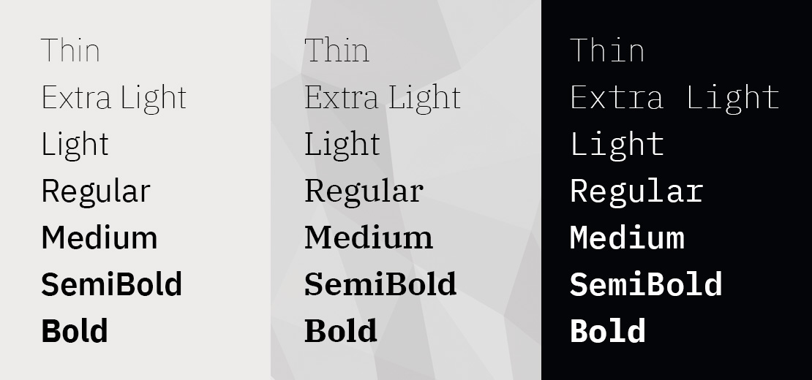
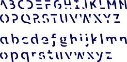

# Serif

## Tinos

# Sans

## Asap

## Liberation Sans

## OpenSans

## PT Sans

## Source Sans Pro
Source Sans Pro is a set of OpenType fonts that have been designed to work well in user interface (UI) environments.
* https://adobe-fonts.github.io/source-sans-pro/
* https://github.com/adobe-fonts/source-sans-pro

## Droid Sans

## DejaVu Sans

## Fira Sans

* https://mozilla.github.io/Fira/
* https://github.com/mozilla/Fira
* https://github.com/bBoxType/FiraSans

## Roboto

## Plex
by IBM
* https://www.ibm.com/plex/
* https://github.com/IBM/plex

## Arimo

## Sans Forgetica

Sans Forgetica is more difficult to read than most typefaces – and that’s by design. The 'desirable difficulty' you experience when reading information formatted in Sans Forgetica prompts your brain to engage in deeper processing.

* https://sansforgetica.rmit/

## Inter
Inter features a tall x-height to aid in readability of mixed-case and lower-case text. Several OpenType features are provided as well, like contextual alternates that adjusts punctuation depending on the shape of surrounding glyphs, slashed zero for when you need to disambiguate "0" from "o", tabular numbers, etc. 

* https://rsms.me/inter/
* https://github.com/rsms/inter

# Sans Narrow

## Play

## PT Sans Narrow

## Cuprum

## Felipe

## Roboto Condensed

# Monospaced

## Consolas

## Inconsolata

## Liberation Mono

## DejaVu Mono
Based on Biststream Vera Sans Mono

## Droid Sans Mono

## Fira Mono

https://www.mozilla.org/en-US/styleguide/products/firefox-os/typeface/

## Source Code Pro

https://github.com/adobe-fonts/source-code-pro/releases/latest

## Terminus

http://terminus-font.sourceforge.net/

http://files.ax86.net/terminus-ttf/files/

http://suseana.ru/?p=451
http://suseana.ru/wp-content/files/terminusre33-bold.ttf.gz

## Hack

https://github.com/chrissimpkins/Hack

## Menlo
Based on Biststream Vera Sans Mono

## Monaco

https://github.com/cstrap/monaco-font

## Monoid

http://larsenwork.com/monoid/

# Monospaced Narrow

## Envy Code R

http://damieng.com/blog/2008/05/26/envy-code-r-preview-7-coding-font-released

## Iosevka

https://be5invis.github.io/Iosevka/

## PragmataPro

http://www.fsd.it/fonts/pragmatapro.htm

# Icons
## Nerd Fonts
Nerd Fonts is a project that patches developer targeted fonts with a high number of glyphs (icons). Specifically to add a high number of extra glyphs from popular 'iconic fonts' such as Font Awesome, Devicons, Octicons, and others.
* https://www.nerdfonts.com/
* https://github.com/ryanoasis/nerd-fonts

